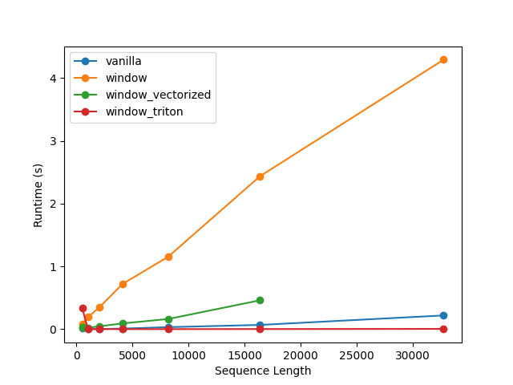
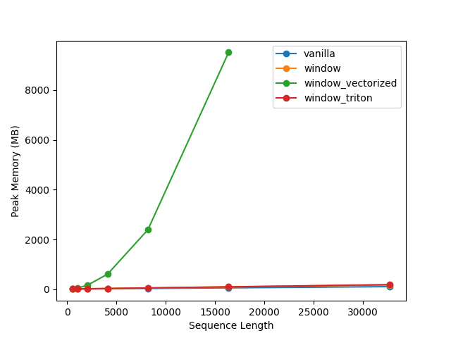

# Triton Sparse Attention

Our work diagnoses a critical bottleneck in transformer scaling: a gap between the theoretical efficiency of sparse attention and its practical implementation. While vectorized PyTorch approaches offer incremental gains over naive implementations, they can actually be slower than a highly-optimized dense baseline for short sequences and fail completely due to quadratic memory requirements at long contexts. 

By engineering a custom, hardware-aware Triton kernel, we fully realize the theoretical efficiency of sparse attention, achieving a speedup of **~14x at 8k tokens, ~24x at 16k tokens,** and up to **~44x at 32k tokens** over a dense baseline. This demonstrates that hardware-level optimization can transform sparse attention from a theoretical advantage into a massive practical win for long-context inference. We achieved this by **overcoming the significant latency of kernel launches, as each individual PyTorch operation adds a fixed overhead. By fusing all operations into a single Triton kernel, we eliminated this bottleneck.**

# Key Results

- **Dense:** Standard transformer attention; all tokens attend to all others (quadratic compute/memory).
- **Window:** Attends only to a local window using Python for-loops.
- **Vectorized:** Windowed attention via PyTorch tensor masking.
- **Triton:** Custom windowed attention using a Triton CUDA kernel (true sparse, fast and memory-light, linear scaling).
  
  
| Seq Len | Dense (s) | Window (s) | Vectorized (s) | Triton (s) | Dense/Triton Speedup |
|---------|-----------|------------|----------------|------------|---------------------|
| 512     | .028      | .159       | .048           | .34        | 0.08×               |
| 1024    | .0012     | .123       | .016           | .0008      | 1.5×                |
| 2048    | .0032     | .244       | .032           | .0010      | 3.2×                |
| 4096    | .0097     | .508       | .078           | .0014      | 6.9×                |
| 8192    | .0303     | 1.120      | .222           | .0023      | 13.2×               |
| 16k     | .0761     | 2.301      | .461           | .0032      | 23.8×               |
| 32k     | .2212     | 4.286      | OOM            | .0050      | **44.2×**               |

## Runtime scaling 


## Memory scaling 


# How to Run

### 1. Clone the repository:
```
git clone https://github.com/devaru-ai/triton-sparse-attention.git
cd triton-sparse-attention
```
### 2. Install dependencies:
```
pip install -r requirements.txt
pip install triton
```

### 3. Run the benchmark
```
python main.py
```

### 4. View results 
View results in the experiments/results/ directory.

